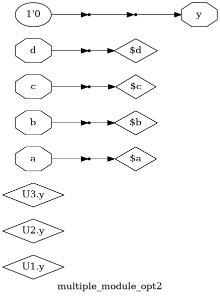

# Combinational and Sequential Optimizations
Logic optimization is a critical step in digital circuit design, aimed at transforming a logical representation of a circuit into a more efficient implementation. This process targets improvements in key metrics such as area, power consumption, and timing performance. Below are summaries of four fundamental optimization techniques.

### Constant Propagation
Constant Propagation is a technique that simplifies a design by identifying signals that are permanently tied to a constant logic value, such as logic '1' (power) or logic '0' (ground). This constant value is then propagated through the downstream combinational and sequential logic.

* **Goal**: To reduce circuit area and power consumption.
* **Method**: The synthesis tool replaces logic gates with simplified equivalents or removes them entirely. For example, if an input 'A' to an AND gate is tied to '0', the gate's output is always '0', regardless of other inputs. Similarly, a flip-flop with its data input tied to '0' and a reset will always output '0'. This simplification cascades through the circuit, eliminating redundant logic and reducing the overall gate count and transistor usage.

### State Optimization

State Optimization, also known as state minimization, is a powerful technique applied to sequential circuits, specifically finite-state machines (FSMs). It aims to reduce the number of states required to implement the FSM's functionality.
* **Goal**: To reduce the number of flip-flops, leading to significant savings in area and power.
* **Method**: The process involves analyzing the FSM's state transition table to identify and merge equivalent states. Two states are considered equivalent if they produce the exact same output for every possible sequence of inputs. By eliminating these redundant states, the FSM can be realized with the minimum possible number of state registers (flip-flops), resulting in a more compact and efficient design.

### Cloning

Cloning, or gate duplication, is a timing-driven optimization used to address high fanout issues. A single gate driving a large number of subsequent gates (high fanout) can become a performance bottleneck due to the large capacitive load, which increases its propagation delay.

* **Goal**: To improve timing performance by reducing delay on critical paths.
* **Method**: The synthesis tool creates duplicates (clones) of the high-fanout gate. The original load is then partitioned and distributed among the original gate and its new clones. Each gate now drives a smaller load, significantly reducing its delay. While this technique is highly effective for meeting timing constraints, it comes with the trade-off of increased circuit area.

### Retiming

Retiming is a sequential optimization technique that enhances a circuit's clock speed by strategically repositioning registers (flip-flops) across combinational logic blocks without altering the circuit's input-output behavior.

* **Goal**: To improve timing performance by enabling a higher clock frequency.
* **Method**: The core idea is to balance the combinational logic delay between different pipeline stages. By moving registers from paths with less delay to paths with longer delays (critical paths), retiming effectively shortens the maximum delay between any two consecutive registers. This reduction in the critical path delay allows the entire circuit to be operated at a faster clock speed, thereby boosting overall performance.


## Lab 6: Combinational Logic Optimizations

### Verilog Code and Synthesis Workflow

##### Optimization Check 1
```verilog
module opt_check (input a , input b , output y);
	assign y = a?b:0;
endmodule
```
```bash
yosys
yosys> read_liberty -lib ../lib/sky130_fd_sc_hd__tt_025C_1v80.lib
yosys> read_verilog opt_check.v
yosys> synth -top opt_check
yosys> opt_clean -purge
yosys> abc -liberty ../lib/sky130/file/sky130_fd_sc_hd__tt_025C_1v80.lib
yosys> show
```


##### Optimization Check 2
```verilog
module opt_check2 (input a , input b , output y);
	assign y = a?1:b;
endmodule
```
```bash
yosys
yosys> read_liberty -lib ../lib/sky130_fd_sc_hd__tt_025C_1v80.lib
yosys> read_verilog opt_check2.v
yosys> synth -top opt_check2
yosys> opt_clean -purge
yosys> abc -liberty ../lib/sky130/file/sky130_fd_sc_hd__tt_025C_1v80.lib
yosys> show
```


##### Optimization Check 3
```verilog
module opt_check3 (input a , input b, input c , output y);
	assign y = a?(c?b:0):0;
endmodule
```
```bash
yosys
yosys> read_liberty -lib ../lib/sky130_fd_sc_hd__tt_025C_1v80.lib
yosys> read_verilog opt_check3.v
yosys> synth -top opt_check3
yosys> opt_clean -purge
yosys> abc -liberty ../lib/sky130/file/sky130_fd_sc_hd__tt_025C_1v80.lib
yosys> show
```


##### Optimization Check 4
```verilog
module opt_check4 (input a , input b , input c , output y);
    assign y = a?(b?(a & c ):c):(!c);
endmodule
```
```bash
yosys
yosys> read_liberty -lib ../lib/sky130_fd_sc_hd__tt_025C_1v80.lib
yosys> read_verilog opt_check4.v
yosys> synth -top opt_check4
yosys> opt_clean -purge
yosys> abc -liberty ../lib/sky130/file/sky130_fd_sc_hd__tt_025C_1v80.lib
yosys> show
```


##### Multiple Modules Check 1
```verilog
module sub_module1(input a , input b , output y);
 assign y = a & b;
endmodule

module sub_module2(input a , input b , output y);
 assign y = a^b;
endmodule

module multiple_module_opt(input a , input b , input c , input d , output y);
wire n1,n2,n3;

sub_module1 U1 (.a(a) , .b(1'b1) , .y(n1));
sub_module2 U2 (.a(n1), .b(1'b0) , .y(n2));
sub_module2 U3 (.a(b), .b(d) , .y(n3));

assign y = c | (b & n1); 

endmodule

```
```bash
yosys
yosys> read_liberty -lib ../lib/sky130_fd_sc_hd__tt_025C_1v80.lib
yosys> read_verilog multiple_module_opt.v
yosys> synth -top multiple_module_opt
yoysy> flatten
yosys> opt_clean -purge
yosys> abc -liberty ../lib/sky130/file/sky130_fd_sc_hd__tt_025C_1v80.lib
yosys> show
```


##### Multiple Modules Check 2
```verilog
module sub_module(input a , input b , output y);
 assign y = a & b;
endmodule

module multiple_module_opt2(input a , input b , input c , input d , output y);
wire n1,n2,n3;

sub_module U1 (.a(a) , .b(1'b0) , .y(n1));
sub_module U2 (.a(b), .b(c) , .y(n2));
sub_module U3 (.a(n2), .b(d) , .y(n3));
sub_module U4 (.a(n3), .b(n1) , .y(y));

endmodule
```
```bash
yosys
yosys> read_liberty -lib ../lib/sky130_fd_sc_hd__tt_025C_1v80.lib
yosys> read_verilog multiple_module_opt2.v
yosys> synth -top multiple_module_opt2
yoysy> flatten
yosys> opt_clean -purge
yosys> abc -liberty ../lib/sky130/file/sky130_fd_sc_hd__tt_025C_1v80.lib
yosys> show
```

 
## Lab 7: Sequential Logic Optimizations
### Verilog Code and Synthesis Workflow


##### DFF Const 1
```verilog
module dff_const1(input clk, input reset, output reg q);
always @(posedge clk, posedge reset)
begin
	if(reset)
		q <= 1'b0;
	else
		q <= 1'b1;
end

endmodule
```
```bash
yosys
yosys> read_liberty -lib ../lib/sky130_fd_sc_hd__tt_025C_1v80.lib
yosys> read_verilog dff_const1.v
yosys> synth -top dff_const1
yosys> dfflibmap -liberty ../lib/sky130_fd_sc_hd__tt_025C_1v80.lib 
yosys> abc -liberty ../lib/sky130/file/sky130_fd_sc_hd__tt_025C_1v80.lib
yosys> show
```


##### DFF Const 2
```verilog
module dff_const2(input clk, input reset, output reg q);
always @(posedge clk, posedge reset)
begin
	if(reset)
		q <= 1'b1;
	else
		q <= 1'b1;
end

endmodule

```
```bash
yosys
yosys> read_liberty -lib ../lib/sky130_fd_sc_hd__tt_025C_1v80.lib
yosys> read_verilog dff_const2.v
yosys> synth -top dff_const2
yosys> dfflibmap -liberty ../lib/sky130_fd_sc_hd__tt_025C_1v80.lib 
yosys> abc -liberty ../lib/sky130/file/sky130_fd_sc_hd__tt_025C_1v80.lib
yosys> show
```


##### DFF Const 3
```verilog
module dff_const3(input clk, input reset, output reg q);
reg q1;

always @(posedge clk, posedge reset)
begin
	if(reset)
	begin
		q <= 1'b1;
		q1 <= 1'b0;
	end
	else
	begin
		q1 <= 1'b1;
		q <= q1;
	end
end

endmodule

```
```bash
yosys
yosys> read_liberty -lib ../lib/sky130_fd_sc_hd__tt_025C_1v80.lib
yosys> read_verilog dff_const3.v
yosys> synth -top dff_const3
yosys> dfflibmap -liberty ../lib/sky130_fd_sc_hd__tt_025C_1v80.lib 
yosys> abc -liberty ../lib/sky130/file/sky130_fd_sc_hd__tt_025C_1v80.lib
yosys> show
```


##### DFF Const 4
```verilog
module dff_const4(input clk, input reset, output reg q);
reg q1;

always @(posedge clk, posedge reset)
begin
	if(reset)
	begin
		q <= 1'b1;
		q1 <= 1'b1;
	end
	else
	begin
		q1 <= 1'b1;
		q <= q1;
	end
end

endmodule
```
```bash
yosys
yosys> read_liberty -lib ../lib/sky130_fd_sc_hd__tt_025C_1v80.lib
yosys> read_verilog dff_const4.v
yosys> synth -top dff_const4
yosys> dfflibmap -liberty ../lib/sky130_fd_sc_hd__tt_025C_1v80.lib 
yosys> abc -liberty ../lib/sky130/file/sky130_fd_sc_hd__tt_025C_1v80.lib
yosys> show
```


##### DFF Const 5
```verilog
module dff_const5(input clk, input reset, output reg q);
reg q1;

always @(posedge clk, posedge reset)
begin
	if(reset)
	begin
		q <= 1'b0;
		q1 <= 1'b0;
	end
	else
	begin
		q1 <= 1'b1;
		q <= q1;
	end
end

endmodule
```
```bash
yosys
yosys> read_liberty -lib ../lib/sky130_fd_sc_hd__tt_025C_1v80.lib
yosys> read_verilog dff_const5.v
yosys> synth -top dff_const5
yosys> dfflibmap -liberty ../lib/sky130_fd_sc_hd__tt_025C_1v80.lib 
yosys> abc -liberty ../lib/sky130/file/sky130_fd_sc_hd__tt_025C_1v80.lib
yosys> show
```
