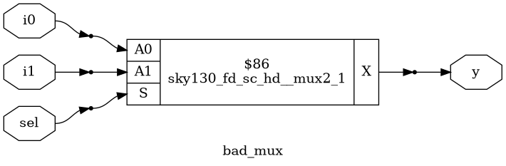
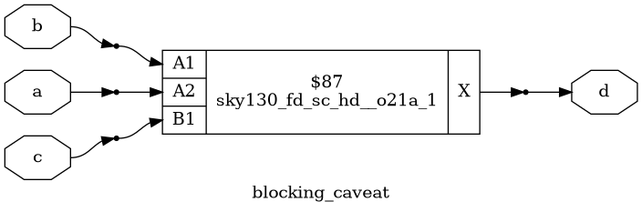

# Gate Level Simulation and Synthesis-Simulation Mismatch

This document provides a comprehensive guide to three fundamental concepts in the digital design and verification workflow: Gate-Level Simulation (GLS), Synthesis-Simulation Mismatch, and the correct usage of Blocking vs. Non-Blocking assignments in Verilog. A solid understanding of these topics is essential for designing robust, synthesizable, and functionally correct hardware.

---

## Gate-Level Simulation (GLS)

### What is GLS?
Gate-Level Simulation (GLS) is a verification step where the synthesized gate-level netlist of a digital circuit is simulated. This process validates the design's behavior after it has been translated from abstract RTL (Register Transfer Level) into a structural netlist of primitive logic gates and flip-flops.

### Why is GLS Necessary?
While RTL simulation is faster, GLS is critical for confirming that the final hardware will function as intended. It is the only way to catch certain classes of bugs.

- **Synthesis Validation:** Ensures the synthesis tool correctly translated the RTL into gates without misinterpretation.
- **Timing Verification:** Simulates the design with realistic cell and interconnect delays (from an SDF file) to detect timing violations like **setup** and **hold** errors.
- **Power Analysis:** Allows for more accurate power estimation based on the switching activity of actual gates.
- **DFT Verification:** Confirms that Design-for-Test structures, such as scan chains, are correctly inserted and functional.
- **Detection of Physical Effects:** Uncovers low-level issues like glitches, race conditions, and problems related to unknown state (`X`) propagation, which are not visible in RTL simulation.

### Key Inputs for GLS
A typical GLS setup requires the following components:
- **Gate-Level Netlist:** The synthesized design description from your synthesis tool.
- **Simulation Libraries:** Foundry-provided libraries that model the behavior of each standard cell (AND, OR, FF, etc.).
- **SDF (Standard Delay Format) File:** Annotates the netlist with accurate timing delays for both cells and routing paths.
- **Testbench:** The verification environment that provides stimulus and checks the design's outputs.

## Synthesis-Simulation Mismatch

### What is a Mismatch?
A synthesis-simulation mismatch occurs when the behavior of the post-synthesis gate-level netlist (or the final silicon) does not match the behavior observed during the pre-synthesis RTL simulation. This indicates a critical flaw in the RTL code or the design process.

### Common Causes
- **Non-Synthesizable Constructs:** Use of Verilog constructs that are ignored by synthesis tools but work in simulation (e.g., `#delays`, `initial` blocks for synthesis, `fork-join`, system tasks like `$display`).
- **Incomplete Logic Specification:**
    - **Incomplete Sensitivity Lists:** In Verilog, forgetting a signal in a combinational `always` block's sensitivity list. The synthesized hardware will react to all inputs, but the simulation will not. Use `always @(*)` to prevent this.
    - **Inferred Latches:** Failing to assign a value to a variable in all branches of an `if` or `case` statement within a combinational block. Synthesis will infer a latch to hold the state, creating unintended memory that doesn't exist in the RTL simulation model.
- **Race Conditions:** Improper use of blocking (`=`) assignments for sequential logic can create race conditions in simulation that hide the true parallel nature of hardware.
- **Tool Interpretation:** Different simulation and synthesis tools may interpret ambiguous or poorly written RTL in slightly different ways.

### Best Practices for Prevention
- ✅ **Write Clean, Synthesizable RTL:** Avoid simulation-only constructs in code intended for hardware.
- ✅ **Use a Linter:** Employ a linting tool to automatically check for common synthesizability issues and style violations.
- ✅ **Follow Strict Coding Guidelines:** Adhere to the "Golden Rules" for blocking and non-blocking assignments.
- ✅ **Specify Full `case` and `if` Statements:** Always include a `default` case for `case` statements and an `else` clause for `if` statements in combinational logic to avoid latch inference.

---

## Verilog: Blocking vs. Non-Blocking Assignments

The choice between blocking (`=`) and non-blocking (`<=`) assignments is one of the most frequent sources of error for Verilog designers. Using the wrong one can directly lead to synthesis-simulation mismatches.

### Core Distinction
- **Blocking (`=`):** Statements execute sequentially. The assignment completes, and the left-hand variable is updated **immediately**, *before* the next statement is executed. It "blocks" the execution flow.
- **Non-Blocking (`<=`):** Statements execute concurrently. The right-hand side is evaluated immediately, but the update to the left-hand variable is **scheduled** to occur at the end of the current time step. It does not "block" other statements.

### Comparison Table

| Feature                 | Blocking Assignment (`=`)        | Non-Blocking Assignment (`<=`)     |
| ----------------------- | -------------------------------- | ---------------------------------- |
| **Operator** | `=`                              | `<=`                             |
| **Execution** | Sequential, immediate update     | Concurrent, scheduled update       |
| **Behavior** | Blocks subsequent statements     | Does not block subsequent statements |
| **Primary Use Case** | Combinational Logic (`always @(*)`) | Sequential Logic (`always @(posedge clk)`) |
| **Infers** | Wires, combinational logic       | Flip-flops, registers              |

### The Golden Rules for RTL Design

> To prevent mismatches and create predictable hardware, follow these two rules strictly:
> 1.  When modeling **sequential logic** (e.g., in an `always @(posedge clk)` block), use **non-blocking** assignments (`<=`).
> 2.  When modeling **combinational logic** (e.g., in an `always @(*)` block), use **blocking** assignments (`=`).

### Code Example: The Critical Difference

Consider a simple 2-bit shift register.

**The WRONG Way (using blocking `=`)**
This code will not simulate as a shift register. In simulation, `q1` gets the value of `din` immediately, and in the *same time step*, `q2` gets this *new* value of `q1`. Both `q1` and `q2` get the value of `din`. However, synthesis will correctly infer two separate flip-flops. **This is a classic mismatch.**

```verilog
// INCORRECT: Causes a simulation-synthesis mismatch
always @(posedge clk) begin
  q1 = din;  // q1 gets din's value immediately
  q2 = q1;   // q2 gets the NEW value of q1, which is din
end
```
**The RIGHT Way (using non-blocking `<=`)**
This code simulates and synthesizes correctly. At the clock edge, the original values of `din` and `q1` are sampled. The updates are scheduled to happen at the end of the time step. This correctly models the parallel behavior of flip-flops in hardware.
```verilog
// CORRECT: Models a shift register properly
always @(posedge clk) begin
  q1 <= din;  // The original value of din is sampled
  q2 <= q1;   // The original value of q1 is sampled
end
```

---

## Gate Level Simulation
### GLS Workflow

```bash
iverilog ternary_operator_mux.v tb_ternary_operator_mux.v
./a.out
gtkwave tb_ternary_operator_mux.vcd     # This is RTL Simulation

yosys
yosys> read_liberty -lib ../lib/sky130_fd_sc_hd__tt_025C_1v80.lib
yosys> read_verilog ternary_operator_mux.v
yosys> synth -top ternary_operator_mux
yosys> abc -liberty ../lib/sky130_fd_sc_hd__tt_025C_1v80.lib
yosys> write_verilog -noattr ternary_operator_mux_net.v

iverilog ../my_lib/verilog_model/primitives.v ../my_lib/verilog_model/sky130_fd_sc_hd.v \ 
ternary_operator_mux.v tb_ternary_operator_mux.v
./a.out
gtkwave tb_ternary_operator_mux.vcd     #This is Gate Level Simulation (GLS)
```


---

## Synthesis Simulation Mismatch
A synthesis–simulation mismatch happens when the behavior you see in RTL simulation (pre-synthesis) doesn’t match the behavior you get in gate-level simulation (GLS) after synthesis. In short:
* RTL sim (behavioral) = what you think your code is doing.
* GLS (post-synthesis) = what the synthesized gates are actually doing.
* If these two don’t agree → mismatch.

### Synthesis-Simulation Mismatch due to a missing Sensitivity List for a MUX
#### Verilog Code
```verilog
module bad_mux (input i0 , input i1 , input sel , output reg y);
always @ (sel)
begin
	if(sel)
		y <= i1;
	else 
		y <= i0;
end
endmodule
```

#### RTL Simulation

#### Gate Level Simulation


#### The Mismatch
* **RTL Simulation**: `y` only changes when `sel` changes.
* **GLS Simulation**: `y` changes whenever any input changes.
* This discrepancy between RTL behavior and synthesized gate-level behavior is called a synthesis–simulation mismatch.

### Synthesis-Simulation Mismatch due to Blocking Assignmment Caveat for OR21AND
#### Verilog Code
```verilog
module blocking_caveat (input a , input b , input  c, output reg d); 
reg x;
always @ (*)
begin
	d = x & c;
	x = a | b;
end
endmodule
```

#### RTL Simulation

#### Gate Level Simulation

#### The Mismatch
* **RTL Simulation**:sequential semantics → `d` uses stale value of `x`.
* **GLS Simulation**: tool optimizes logic → `d = (a | b) & c`.
