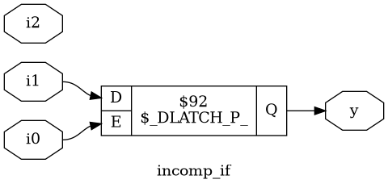

# Optimization in Synthesis

## If-Else Statements

**`If-else` statements** are used to control the flow of execution in behavioral Verilog code based on specified conditions. They are exclusively used within procedural blocks such as `always`, `initial`, `task`, or `function`.

### Syntax

The fundamental structure of an `if-else` statement is as follows:

```verilog
if (condition) begin
    // Statement block executed if the condition is true (non-zero)
end else begin
    // Statement block executed if the condition is false (zero, 'x', or 'z')
end
```

-   **`condition`**: An expression that is evaluated. If its result is true (non-zero), the first block of code is executed.
-   **`begin ... end`**: These keywords are used to group multiple statements. They can be omitted if only a single statement is to be executed within the `if` or `else` block.
-   **`else`**: The `else` portion is optional and provides an alternative path for execution when the condition is false.

#### Nested If-Else

For more complex decision-making, `if-else` statements can be chained together to evaluate multiple conditions sequentially.

```verilog
if (condition1) begin
    // Code for when condition1 is true
end else if (condition2) begin
    // Code for when condition1 is false and condition2 is true
end else begin
    // Code for when all preceding conditions are false
end
```

---

## Inferred Latches in Verilog

An **inferred latch** is a storage element created by a synthesis tool when a variable (typically a `reg`) within a combinational logic block is not assigned a value in all possible execution paths. Because the logic doesn't specify an output for every input condition, the tool implements a latch to hold the variable's last known value. This is often an unintended result and can cause timing problems in a design.

### Example of Latch Inferred latches

```verilog
module ex (
    input wire a, b, sel,
    output reg y
);
    always @(a, b, sel) begin
        if (sel == 1'b1)
            y = a; // No 'else' - y is not assigned when sel == 0
    end
endmodule
```

**Problem**: When `sel` is 0, `y` is not assigned, so a latch is inferred.

#### Solution: Add Else or Default Case

```verilog
module ex (
    input wire a, b, sel,
    output reg y
);
    always @(a, b, sel) begin
        case(sel)
            1'b1 : y = a;
            default : y = 1'b0; // Default assignment
        endcase
    end
endmodule
```

---

## Lab 8: Incomplete IF Problems

### Incomplete IF 1
#### Verilog Code
```verilog
module incomp_if (input i0 , input i1 , input i2 , output reg y);
always @ (*)
begin
	if(i0)
		y <= i1;
end
endmodule
```


* We were expecting a mux but we get a latch instead due to an incomplete if.

### Incomplete IF 2
#### Verilog Code
```verilog
module incomp_if2 (input i0 , input i1 , input i2 , input i3, output reg y);
always @ (*)
begin
	if(i0)
		y <= i1;
	else if (i2)
		y <= i3;

end
endmodule
```


* We were not expecting any latches but we get a latch instead due to an incomplete if.

---

## Lab 9: Incomplete Overlapping Case Problems

### Incomplete Case
#### Verilog Code
```verilog
module incomp_case (input i0 , input i1 , input i2 , input [1:0] sel, output reg y);
always @ (*)
begin
	case(sel)
		2'b00 : y = i0;
		2'b01 : y = i1;
	endcase
end
endmodule
```


* The output follows `i0` and `i1` as intended but when it should follow i2 it latches.
### Complete Case
#### Verilog Code
```verilog
module comp_case (input i0 , input i1 , input i2 , input [1:0] sel, output reg y);
always @ (*)
begin
	case(sel)
		2'b00 : y = i0;
		2'b01 : y = i1;
        default : y = i2;
	endcase
end
endmodule
```


### Partial Case
#### Verilog Code
```verilog
module partial_case_assign (input i0 , input i1 , input i2 , input [1:0] sel, output reg y , output reg x);
always @ (*)
begin
	case(sel)
		2'b00 : begin
			y = i0;
			x = i2;
			end
		2'b01 : y = i1;
		default : begin
		           x = i1;
			   y = i2;
			  end
	endcase
end
endmodule
```

* The simulator gives up and no simulation happens and the synthesized netlist is also wrong.

### Bad Case
#### Verilog Code
```verilog
module bad_case (input i0 , input i1, input i2, input i3 , input [1:0] sel, output reg y);
always @(*)
begin
	case(sel)
		2'b00: y = i0;
		2'b01: y = i1;
		2'b10: y = i2;
		2'b1?: y = i3;
		//2'b11: y = i3;
	endcase
end

endmodule
```


* In case of `sel = 11`, output `y` latches to `1` because there are two conditions for `sel = 11`.

---

## For Loops in Verilog

A **`for` loop** is a procedural statement used to execute a block of code a specific number of times. It is used exclusively within procedural contexts like `initial` blocks, `always` blocks, tasks, and functions.

### Syntax

The structure of a `for` loop is as follows:

```verilog
for (initialization; condition; increment) begin
    // Statements to be executed repeatedly
end
```

**Key Points:**
-   It must be located inside a procedural block.
-   For a loop to be **synthesizable** into hardware, the synthesis tool must be able to determine the total number of iterations at compile time. The loop bounds cannot depend on dynamic, run-time values.

#### Example: 4-to-1 MUX Using a For Loop

A `for` loop can efficiently model combinational logic. In this example, the loop iterates through the inputs and uses an `if` statement to model the selection logic of a multiplexer.

```verilog
module mux_4to1_for_loop (
    input wire [3:0] data, // 4 input lines
    input wire [1:0] sel,  // 2-bit select
    output reg y           // Output
);
    integer i;

    always @(data, sel) begin
        y = 1'b0; // Default output to avoid inferred latches
        for (i = 0; i < 4; i = i + 1) begin
            if (i == sel)
                y = data[i];
        end
    end
endmodule
```

---

## Generate Blocks in Verilog

A **`generate` block** is a compile-time construct used to create multiple instances of hardware structures like modules, logic gates, or even other procedural blocks. It is essential for building scalable and parameterizable designs.

Generate blocks typically use a `for` loop, but the loop variable must be declared as a **`genvar`**. A `genvar` is a special variable that exists only during the elaboration phase (a part of compilation) to generate the hardware instances.

#### Example: Instantiating Multiple Gates

This example uses a generate-for loop to create an array of four `and_gate` instances. The synthesis tool effectively "unrolls" this loop to create four distinct gates in the final hardware netlist.

```verilog
// This generate block creates 4 instances of an 'and_gate' module.
// Note: An 'and_gate' module definition is assumed to exist.

genvar i; // Declare a generation variable

generate
    for (i = 0; i < 4; i = i + 1) begin : gen_loop
        // Each loop iteration creates a unique hardware instance
        and_gate and_inst (.a(in[i]), .b(in[i+1]), .y(out[i]));
    end
endgenerate
```

---

## Lab 10: Usecases of for and for generate 

### 4 to 1 MUX using for loop

```verilog
module mux_generate (
    input i0, input i1, input i2, input i3,
    input [1:0] sel,
    output reg y
);
wire [3:0] i_int;
assign i_int = {i3, i2, i1, i0};
integer k;
always @(*) begin
    for (k = 0; k < 4; k = k + 1) begin
        if (k == sel)
            y = i_int[k];
    end
end
endmodule
```


### 8 to 1 Demux using case
```verilog
module demux_case (
    output o0, output o1, output o2, output o3,
    output o4, output o5, output o6, output o7,
    input [2:0] sel,
    input i
);
reg [7:0] y_int;
assign {o7, o6, o5, o4, o3, o2, o1, o0} = y_int;
always @(*) begin
    y_int = 8'b0;
    case(sel)
        3'b000 : y_int[0] = i;
        3'b001 : y_int[1] = i;
        3'b010 : y_int[2] = i;
        3'b011 : y_int[3] = i;
        3'b100 : y_int[4] = i;
        3'b101 : y_int[5] = i;
        3'b110 : y_int[6] = i;
        3'b111 : y_int[7] = i;
    endcase
end
endmodule
```


### 8 to 1 Demux using for loop
```verilog
module demux_generate (
    output o0, output o1, output o2, output o3,
    output o4, output o5, output o6, output o7,
    input [2:0] sel,
    input i
);
reg [7:0] y_int;
assign {o7, o6, o5, o4, o3, o2, o1, o0} = y_int;
integer k;
always @(*) begin
    y_int = 8'b0;
    for (k = 0; k < 8; k = k + 1) begin
        if (k == sel)
            y_int[k] = i;
    end
end
endmodule
```


### 8bit Ripple Carry Adder with generate block
```verilog
module rca (
    input [7:0] num1,
    input [7:0] num2,
    output [8:0] sum
);
wire [7:0] int_sum;
wire [7:0] int_co;

genvar i;
generate
    for (i = 1; i < 8; i = i + 1) begin
        fa u_fa_1 (.a(num1[i]), .b(num2[i]), .c(int_co[i-1]), .co(int_co[i]), .sum(int_sum[i]));
    end
endgenerate

fa u_fa_0 (.a(num1[0]), .b(num2[0]), .c(1'b0), .co(int_co[0]), .sum(int_sum[0]));

assign sum[7:0] = int_sum;
assign sum[8] = int_co[7];
endmodule
```
#### Full Adder Module
```verilog
module fa (input a, input b, input c, output co, output sum);
    assign {co, sum} = a + b + c;
endmodule
```

